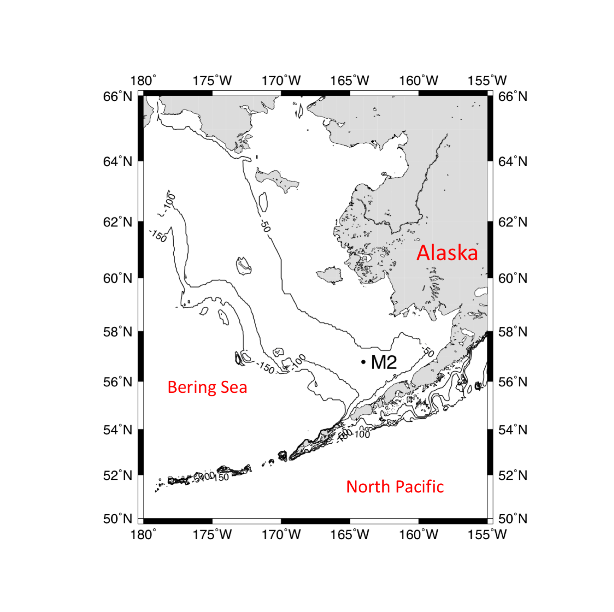
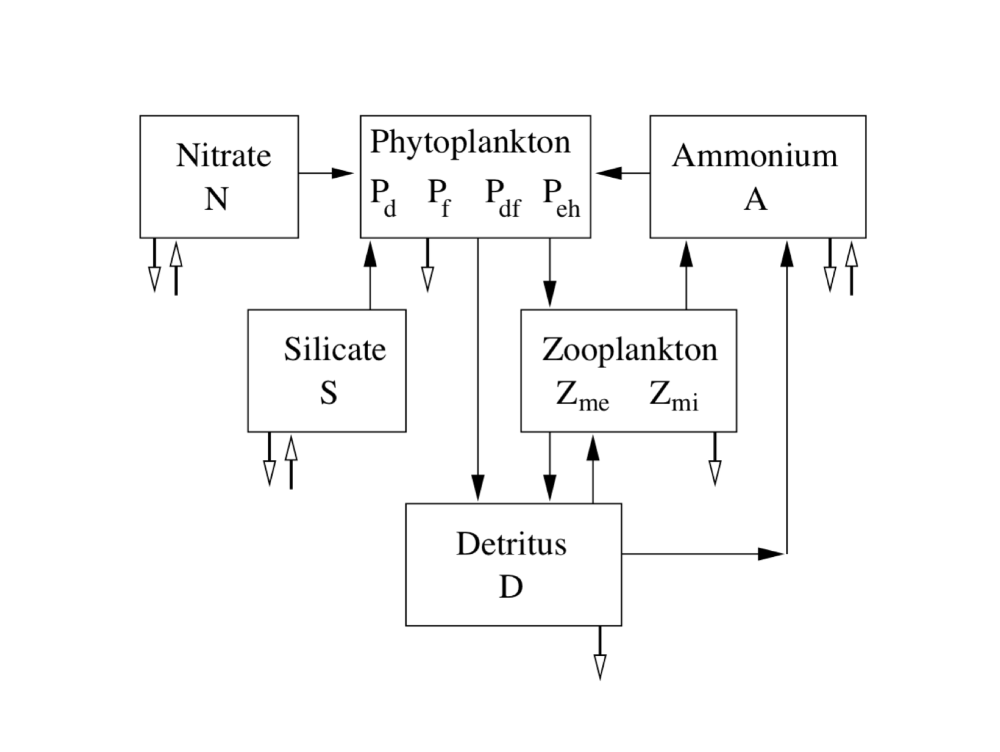

# PlanktonBS
Differential Equation-Based model for studying the seasonal succession of phytoplankton in the Eastern Bering Sea.

# Location
The model is applied in a point location (M2) of the Southeastern Bering Sea, as indicated in the map below.



# Model description
The model includes (1) four phytoplankton functional types (diatoms, flagellates, autotrophic dinoflagellates, and the coccolithoporid *Emiliania huxleyi*), (2) two zooplankton types (micrzooplankton and mesozooplankton), (3) three types of dissolved inorganic nutrients (nitrate, ammonium, and silicate), (4) detritus, (5) attached and free coccoliths, (6) dissolved inorganic carbon (DIC), and (7) total alkalinity, for a total of 14 differential equation. The model resolves the full carbonate system by calculating (based on DIC and alkalinity): bicarbonate ion concentration, carbonate ion concentration, omega calcite, omega aragonite, and pH. A simplified model schematic is shown below.




# How to run the model
The model has to be compiled with C++ from the [Gnu Compiler Collection](https://en.wikipedia.org/wiki/GNU_Compiler_Collection) using the command `g++` as follows:

```
     g++ succession4new.cc routines.cc nrutil.cc -o a.out -Wno-deprecated
```

This creates the executable called `a.out`, which is run by typing `./a.out`. The option `-Wno-deprecated` avoid getting warnings about the usage of deprecated features.

The model requires input files (forcing environmental functions, including Mixed Layer Depth, Seas Surface Temperature, Wind Speed, and Salinity), which have to be stored in a subdirectory called `./input`.

Header files (`param.h` and `nrutil.h` have to be present in the current directory).

Crucial model parameters are:

```c++
     # define NEQ 14         // number of ordinary differential equations
     # define Y 9            // number of years for which run the model (0 is one year cycle)
     # define IGNY 0         // number of years required by the model to reach equilibrium (spin-up)
     # define HOFY 4320      // hour of the year to consider for poincare' sections
```

Results are saved in a subdirectory called `results`.
